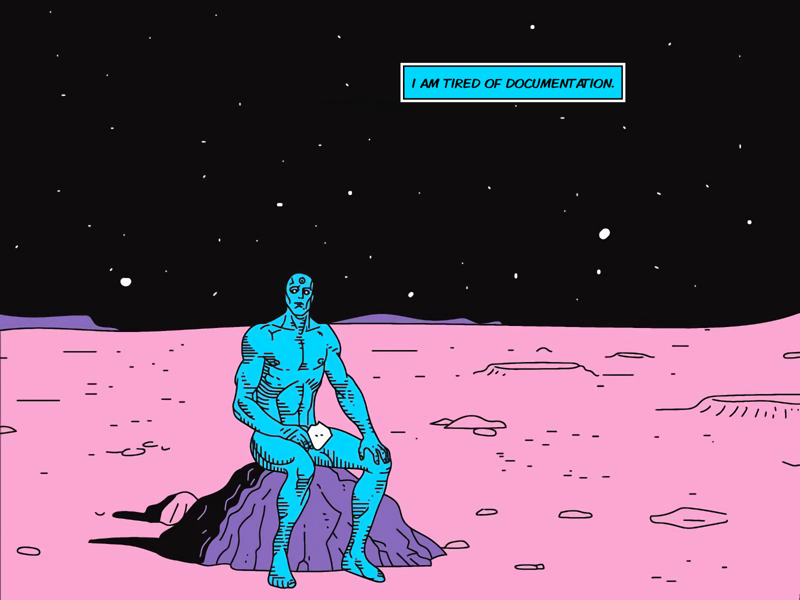

# Tired Manhattan Twitter Bot and Image Generator

This Twitter bot uses [ImageSharp](https://sixlabors.com) to generate
a custom image of [Dr. Manhattan](https://en.wikipedia.org/wiki/Doctor_Manhattan) sitting on
Mars being Tired of... well anything.

It listens for mentions at [@TiredManhattan](https://twitter.com/TiredManhattan) for text and generates a custom image. You
can also call an endpoint (`/image?text=`) to generate an image locally. Finally, you
can have the bot tweet by calling `/tweet?text=`. That said, only I, [@buhakmeh](https://twitter.com/buhakmeh)
have the credentials, so you'll have to make your own bot :)

That said, this is a great starting point if you're building a Twitter bot to respond
to folks on Twitter. 

## Requirements

- .NET 6+ - https://dot.net
- Twitter API Credentials (enhanced for filtered streams)

## Technology

- ImageSharp - https://sixlabors.com
- TweetinviAPI - https://github.com/linvi/tweetinvi
- Profanity Detector - https://github.com/stephenhaunts/ProfanityDetector
- ASP.NET Core - https://dot.net
- Slugify.Core - https://github.com/ctolkien/Slugify

## License 

Copyright © 2022 khalidabuhakmeh

Permission is hereby granted, free of charge, to any person obtaining a copy of this software and associated documentation files (the “Software”), to deal in the Software without restriction, including without limitation the rights to use, copy, modify, merge, publish, distribute, sublicense, and/or sell copies of the Software, and to permit persons to whom the Software is furnished to do so, subject to the following conditions:

The above copyright notice and this permission notice shall be included in all copies or substantial portions of the Software.

THE SOFTWARE IS PROVIDED “AS IS”, WITHOUT WARRANTY OF ANY KIND, EXPRESS OR IMPLIED, INCLUDING BUT NOT LIMITED TO THE WARRANTIES OF MERCHANTABILITY, FITNESS FOR A PARTICULAR PURPOSE AND NONINFRINGEMENT. IN NO EVENT SHALL THE AUTHORS OR COPYRIGHT HOLDERS BE LIABLE FOR ANY CLAIM, DAMAGES OR OTHER LIABILITY, WHETHER IN AN ACTION OF CONTRACT, TORT OR OTHERWISE, ARISING FROM, OUT OF OR IN CONNECTION WITH THE SOFTWARE OR THE USE OR OTHER DEALINGS IN THE SOFTWARE.